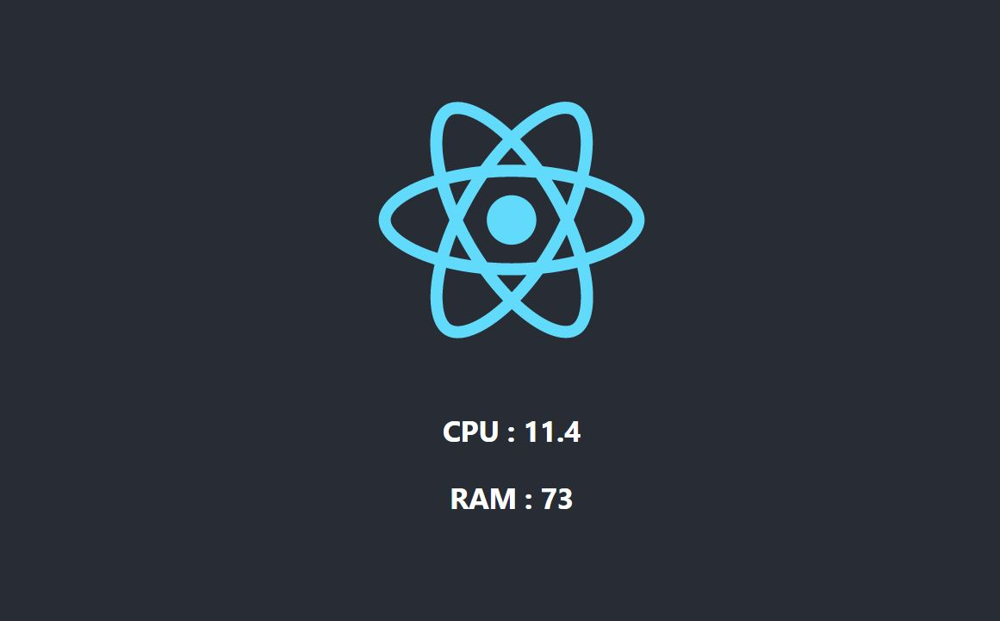

# DevOps-Sample

In this repo, you will find a simple Python - Flask Web App, which reads the current RAM and CPU usage and a React frontend which shows the statistics in the browser.



## How to run?

The app is setup in a pretty standard way, just like most Python-React Apps.

### Python Backend
In the api directory, do the following. 
1. `pip install -r requirements.txt`
2. `python app.py`
3. Visit `http://localhost:8000/stats`


### React Frontend
In the sys-stats directory, do the following.
1. `npm install`
2. `npm start`

## Task 1 - Dockerize the Application

1. api/Dockerfile-
   - This create Docker container by installing requirements.txt and then running app.py while exposing on port 8000. `:8000/stats` reference is expected to resolve to flask app. We call it `api` in docker-compose.yml file
2. sys-stats/Dockerfile-
  - This create Docker container by installing npm dependencies, then `npm run build` on each run. Finally exposes frontend 
    on port 3000 thru `npm run start`. We call it `client` in docker-compose.yml file later.
3. nginx/Dockerfile-
   - This create Docker container to reverse proxy client & server over port `80`. `Default 80` in client configuration of default.nginx points to `server` over port 3000. `/api` in default.nginx points to `client` over port 8000.
   So,in nutshell, when we run `docker-compose up --build` command, then it brings up react application over port `http://localhost` and `http://localhost/api/stats` resolves to client flask application. Browse below to validate in browser-
   ```
      http://localhost
      http://localhost/api/stats
   ```

4. Stop `docker-compose up --build` command to free up port 80.

## Task 2 - Deploy on Cloud

1. create account in azure cloud `https://azure.microsoft.com/en-in/get-started/azure-portal/`
2. Install Azure cli from `https://docs.microsoft.com/en-us/cli/azure/install-azure-cli`
3. Login to Azure cloud
```
az login
```
4. Export variables in bash profile and source it.
```
~/.bashrc
export RESOURCE_GROUP=rg-hello-world
export CLUSTER_NAME=aks-hello-world
export LOCATION=southindia
. ~/.bashrc
```

5. Create Active Directory Service Principal-
```
az ad sp create-for-rbac --skip-assignment
{
  "appId": "aaaaaaaa-aaaa-aaaa-aaaa-aaaaaaaaaaaa",
  "displayName": "azure-cli-2022-07-09-07-46-05",
  "name": "http://azure-cli-2022-07-09-07-46-05",
  "password": "aaaaaaaa-aaaa-aaaa-aaaa-aaaaaaaaaaaa",
  "tenant": "aaaaaaaa-aaaa-aaaa-aaaa-aaaaaaaaaaaa"
}
```

6. Update appID and password in terraform.tfvars file-
terraform.tfvars
```
appId    = "aaaaaaa-aaaa-aaaa-aaaa-aaaaaaaaaaaa"
password = "aaaaaaaa-aaaa-aaaa-aaaa-aaaaaaaaaaaa"
aksClusterName = "aks-hello-world"
resourceGroupName = "rg-hello-world"
```

6. Create Azure resource groups and AKS cluster- 
```
terraform init
terraform apply --auto-approve
Apply complete! Resources: 2 added, 0 changed, 2 destroyed.

Outputs:

kubernetes_cluster_name = "aks-hello-world"
resource_group_name = "rg-hello-world"
```
7.  Download and install `kubectl` from `https://kubernetes.io/docs/tasks/tools/` and set alias in k for kubectl in bash profile
Check minikube nodes are ready.  


8.link kubectl to use AKS cluster
```
az aks get-credentials --resource-group $(terraform output -raw resource_group_name) --name $(terraform output -raw kubernetes_cluster_name)
Merged "aks-hello-world" as current context in /home/sauahuja/.kube/config
k config get-contexts
CURRENT   NAME                  CLUSTER               AUTHINFO                                             NAMESPACE
*         aks-hello-world       aks-hello-world       clusterUser_rg-hello-world_aks-hello-world           
k get nodes
NAME                              STATUS   ROLES   AGE     VERSION
aks-default-35476689-vmss000000   Ready    agent   2m13s   v1.22.6
```

9. Apply deployment.yaml to deploy api and client pods and run its deployments resources in k8s.
```
k apply -f deployment.yaml
Wait for few minutes until all deployments are READY as 1/1.
k get deploy -w
NAME              READY   UP-TO-DATE   AVAILABLE   AGE
api-app           1/1     1            1           72m
client-app        1/1     1            1           72m
```
10. Apply service.yaml to expose api and client services over port 80

```
k apply -f service.yaml
k get service
NAME         TYPE        CLUSTER-IP     EXTERNAL-IP   PORT(S)   AGE
api-app      ClusterIP   10.0.241.248   <none>        80/TCP    22m
client-app   ClusterIP   10.0.73.197    <none>        80/TCP    22m
```
11. Enable http routing in AKS cluster and Apply ingress.yaml file

```
az aks enable-addons --resource-group $RESOURCE_GROUP --name $CLUSTER_NAME --addons http_application_routing

az aks show \
  -g $RESOURCE_GROUP \
  -n $CLUSTER_NAME \
  -o tsv \
  --query addonProfiles.httpApplicationRouting.config.HTTPApplicationRoutingZoneName
 6767832f308847f298ac.southindia.aksapp.io 

Update ingress.yaml line for #host config line 16, as hello.6767832f308847f298ac.southindia.aksapp.io

k apply -f ingress.yaml -w
Wait for few minutes until ADDRESS field is shown as it can upto 5 minutes
k get ingress
NAME            CLASS    HOSTS                                             ADDRESS           PORTS   AGE
hello-website   <none>   hello.6767832f308847f298ac.southindia.aksapp.io   104.211.207.186   80      58s
```
Browse below in browser to see ui is loading.
Browse  below in browser to see rest api backned service is also loading. 

http://104.211.207.186/

http://hello.c054786f87e443ccbed7.southindia.aksapp.io/api/stats  

```
{"cpu":4.3,"ram":29.9}
```

### Task 3 - Get it to work with local minikube Kubernetes

1. Download and Install `minikube` from `https://minikube.sigs.k8s.io/docs/start/`  
2. Start minikube
```
minikube start
```
3. Download and install `kubectl` from `https://kubernetes.io/docs/tasks/tools/` and set alias in k for kubectl in bash profile
Check minikube nodes are ready  

```
k get nodes
```

4. Apply deployment.yaml to deploy api and client pods and run its deployments resources in k8s.
```
k apply -f deployment.yaml
k get deployments
NAME         READY   UP-TO-DATE   AVAILABLE   AGE
api-app      1/1     1            1           131m
client-app   1/1     1            1           131m
```
5. Apply minikube_service.yaml to expose api and client services over port 80

```
k apply -f minikube_service.yaml
k get service
NAME         TYPE        CLUSTER-IP    EXTERNAL-IP   PORT(S)        AGE
api-app      NodePort    10.96.37.23   <none>        80:30125/TCP   50m
client-app   NodePort    10.106.27.1   <none>        80:30405/TCP   50m
kubernetes   ClusterIP   10.96.0.1     <none>        443/TCP        133m
```
6. Get minikube service urls
```
minikube service list
|---------------|------------------------------------|--------------|---------------------------|
|   NAMESPACE   |                NAME                | TARGET PORT  |            URL            |
|---------------|------------------------------------|--------------|---------------------------|
| default       | api-app                            |           80 | http://192.168.49.2:30125 |
| default       | client-app                         |           80 | http://192.168.49.2:30405 |
```
Browse below in browser to validate its working-
```
http://192.168.49.2:30405/  

http://192.168.49.2:30125/stats
```

7. Enable Ingress Addon in minikube and validate

```
minikube addons enable ingress
kubectl get pods -n ingress-nginx
NAME                                        READY   STATUS      RESTARTS    AGE
ingress-nginx-admission-create-g9g49        0/1     Completed   0          11m
ingress-nginx-admission-patch-rqp78         0/1     Completed   1          11m
ingress-nginx-controller-59b45fb494-26npt   1/1     Running     0          11m
```
8. Make entry in `/etc/hosts` file
```
minikube ip
192.168.49.2
cat /etc/hosts
192.168.49.2    hello-world.info
```
8. Apply minikube_ingress.yaml file

```
k apply -f minikube_ingress.yaml
k get ingress
NAME              CLASS   HOSTS              ADDRESS        PORTS   AGE
example-ingress   nginx   hello-world.info   192.168.49.2   80      107m

Browse below in browser for client app to validate react client app is running on port 80.
```
http://hello-world.info/api/stats  

http://192.168.49.2


9. Stop minikube
```
minikube stop
```